# Wallpaper Collection

A curated collection of wallpapers tailored for tiling window managers (Hyprland, Sway, i3, BSPWM, etc.).

## Preview

* Image
 	| A  			|  B|
	| -------------|:-----------------:|
    |  |  |
    |  |  |
    |  |  |
    |  |  |
    | 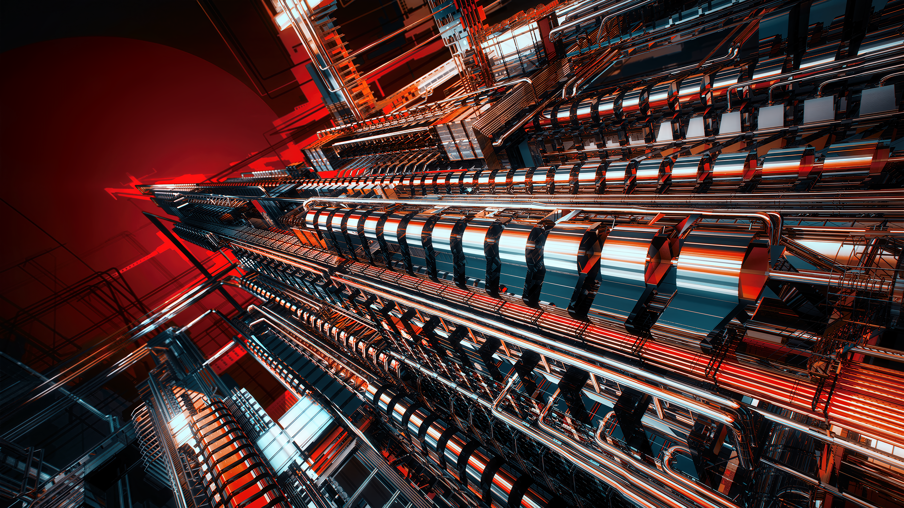 | 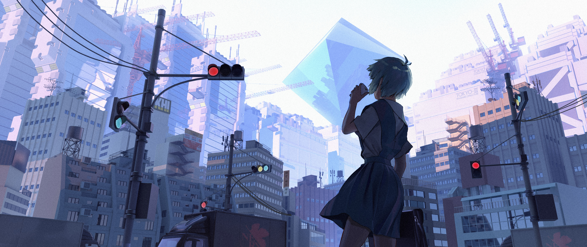 |
    |  |  |
    | 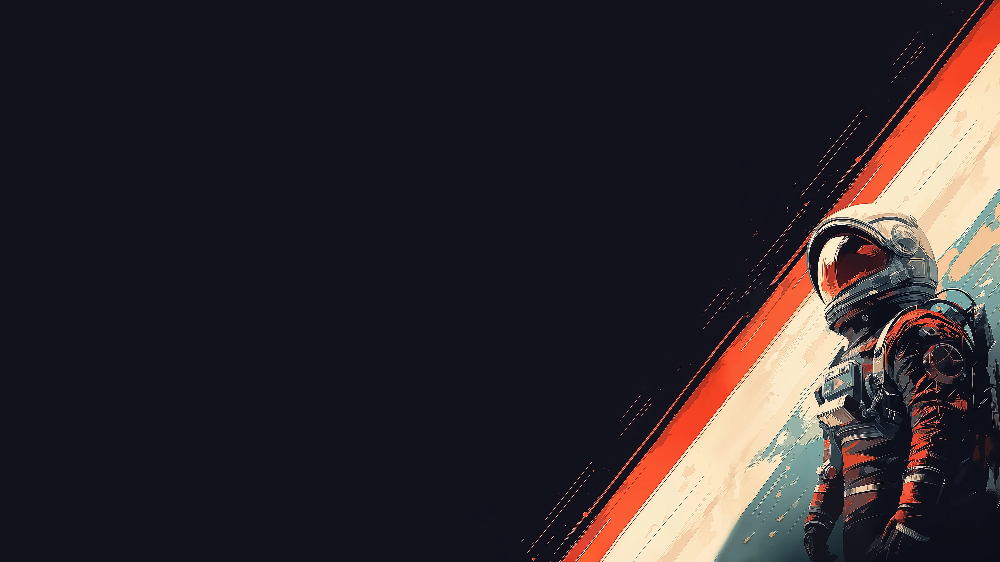 |  |
    |  | 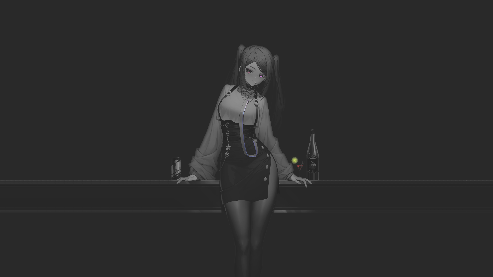 |
    | 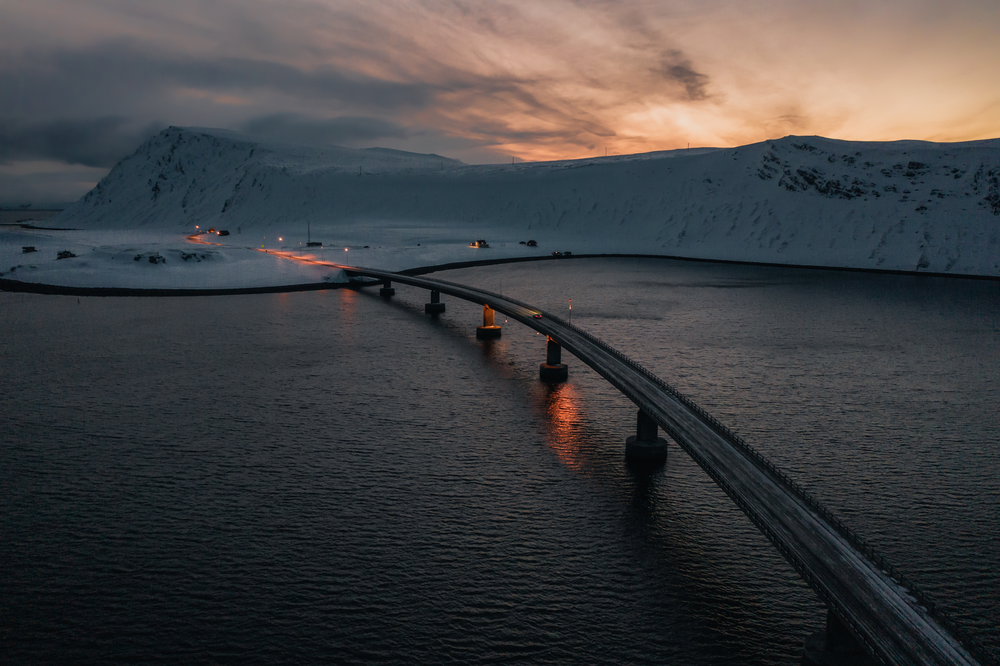 | 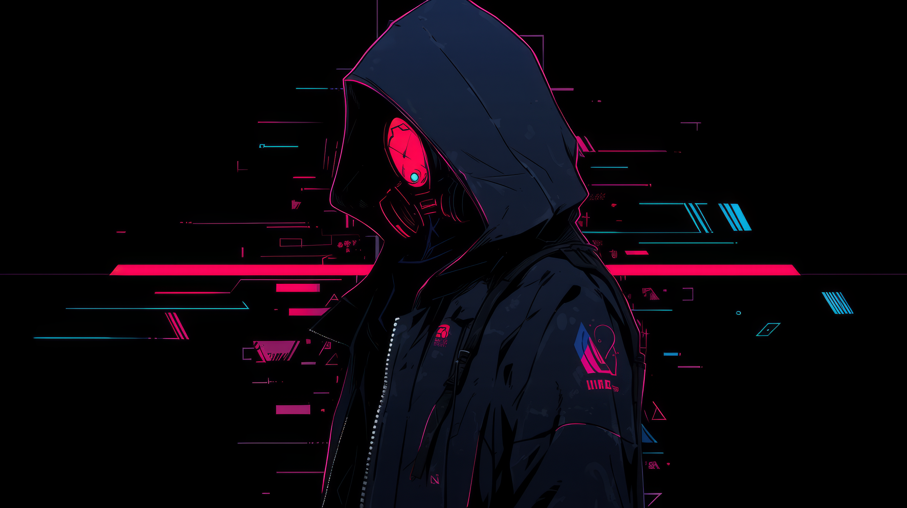 |
    |  |  |
    |  |  |
    |  |  |
    |  | 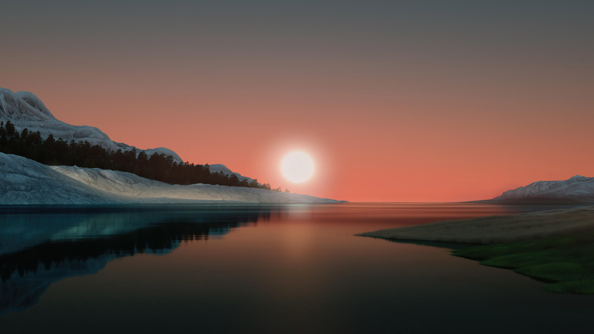 |
    | 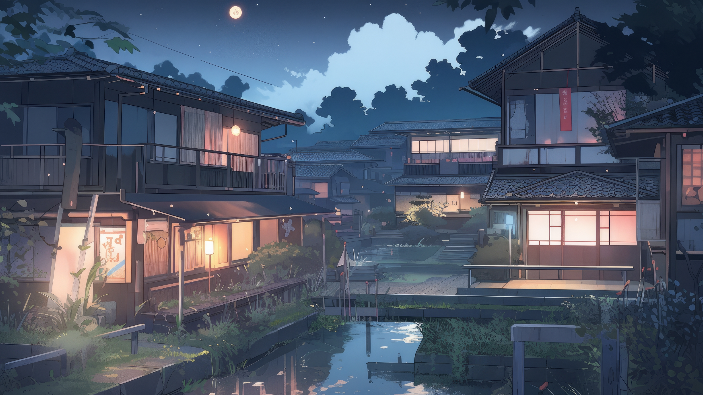 |  |
    | 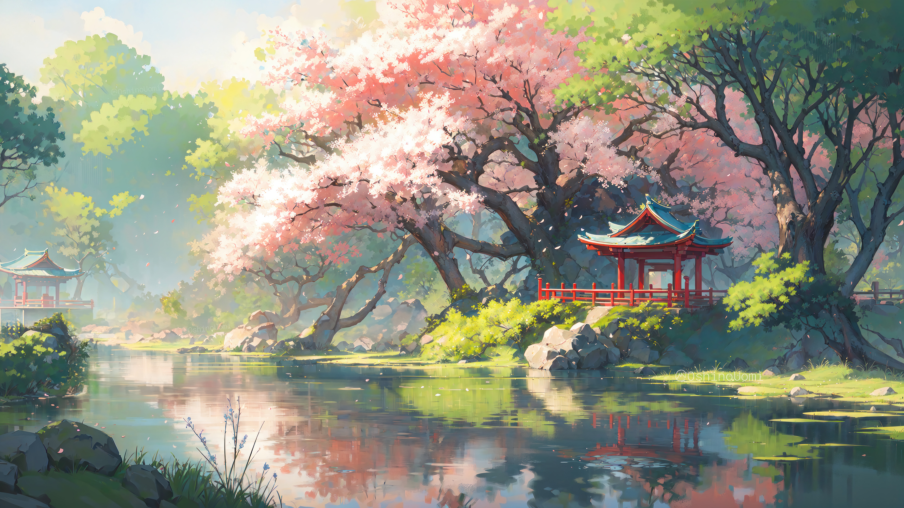 |  |
    |  |  |
    |  |  |
    |  | 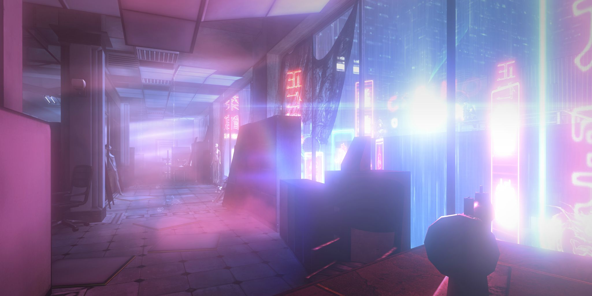 |
    | 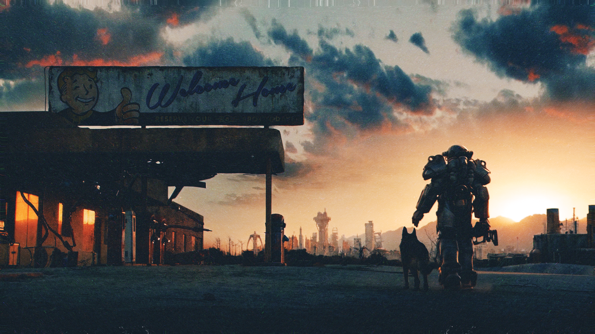 |  |
    |  |  |
    |  |  |
    |  |  |
> 📁 **Note:** Explore the repository files to see the complete collection of images and animated wallpapers.

---

## Installation

Clone this repository into your preferred directory (e.g., `~/Pictures`):

```bash
cd ~/Pictures
git clone --depth=1 [https://github.com/VirtualZeroResolution/Wallpapers.git](https://github.com/VirtualZeroResolution/Wallpapers.git)
cd Wallpapers
```
> Integration: If you are using ML4W Dotfiles for Hyprland, you can easily set this directory as your active wallpaper source using Waypaper.


## UPDATE

To fetch the latest wallpapers, run:
```
cd ~/Pictures/Wallpapers
git pull
```

## Wallpaper Resources

Great download resources for wallpapers are:

https://www.reddit.com/r/wallpapers/

https://4kwallpapers.com

https://buymeacoffee.
