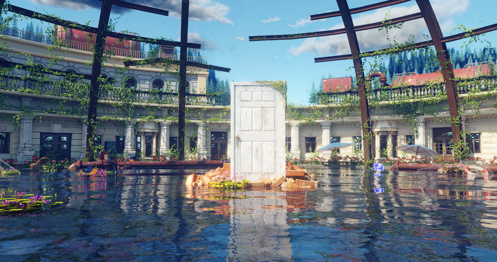

# Wallpaper Collection

My personal wallpaper collection that fits best to tiling window managers.

* Image 
	| -------------|:-----------------:|
	| ||
	| ||
	| ||

## Installation

Clone the directory from your home directory.

```
cd ~/Pictures # You can also choose a different location
git clone --depth=1 
cd wallpaper/
```
If you are using the ML4W Dotfiles for Hyprland, you can select the the new wallpaper folder with Waypaper.

## Update

You can update the wallpapers with

```
cd ~/Pictures/wallpaper
git pull
```
## Wallpaper Resources

Great download resources for wallpapers are:

https://www.reddit.com/r/wallpapers/

https://4kwallpapers.com

https://buymeacoffee.com/wallsbyjfl/posts/11032
